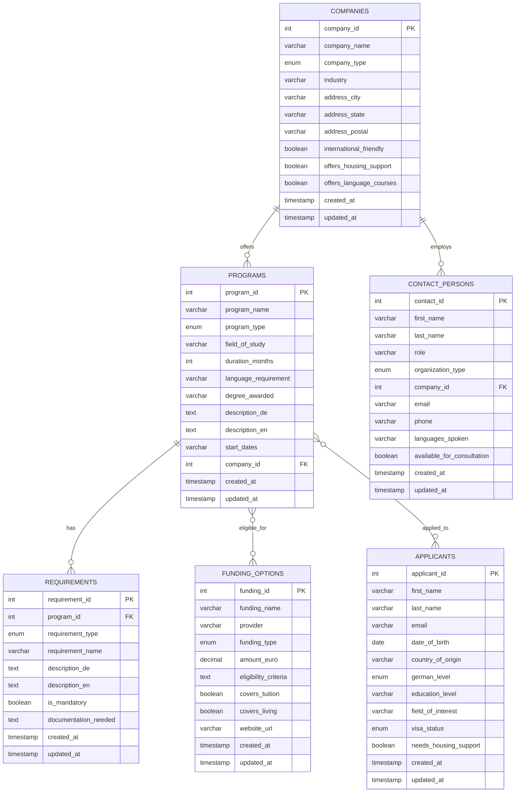

# Dual Connect - Entity-Relationship Diagram

## Visual ER Diagram

### ASCII Representation

```
┌─────────────────────────────────────────────────────────────┐
│                        COMPANIES                             │
│─────────────────────────────────────────────────────────────│
│ PK │ company_id          │ INT                              │
│    │ company_name        │ VARCHAR(200)                     │
│    │ company_type        │ ENUM                             │
│    │ industry            │ VARCHAR(100)                     │
│    │ address_city        │ VARCHAR(100)                     │
│    │ address_state       │ VARCHAR(100)                     │
│    │ international_friendly │ BOOLEAN                       │
└──────────┬──────────────────────────────────────────────────┘
           │
           │ 1:M (offers)
           │
           ▼
┌─────────────────────────────────────────────────────────────┐
│                        PROGRAMS                              │
│─────────────────────────────────────────────────────────────│
│ PK │ program_id          │ INT                              │
│    │ program_name        │ VARCHAR(200)                     │
│    │ program_type        │ ENUM                             │
│    │ field_of_study      │ VARCHAR(100)                     │
│    │ duration_months     │ INT                              │
│    │ language_requirement│ VARCHAR(50)                      │
│ FK │ company_id          │ INT                              │
└──────────┬──────────────────────────────────────────────────┘
           │
           │ 1:M (has)
           │
           ▼
┌─────────────────────────────────────────────────────────────┐
│                      REQUIREMENTS                            │
│─────────────────────────────────────────────────────────────│
│ PK │ requirement_id      │ INT                              │
│ FK │ program_id          │ INT                              │
│    │ requirement_type    │ ENUM                             │
│    │ requirement_name    │ VARCHAR(200)                     │
│    │ is_mandatory        │ BOOLEAN                          │
└─────────────────────────────────────────────────────────────┘


┌─────────────────────────────────────────────────────────────┐
│                   CONTACT_PERSONS                            │
│─────────────────────────────────────────────────────────────│
│ PK │ contact_id          │ INT                              │
│    │ first_name          │ VARCHAR(100)                     │
│    │ last_name           │ VARCHAR(100)                     │
│    │ role                │ VARCHAR(100)                     │
│    │ organization_type   │ ENUM                             │
│ FK │ company_id          │ INT (nullable)                   │
│    │ email               │ VARCHAR(100)                     │
│    │ languages_spoken    │ VARCHAR(200)                     │
└─────────────────────────────────────────────────────────────┘
           ▲
           │
           │ M:1 (employed by)
           │
           │
    ┌──────┴────────┐
    │  COMPANIES    │
    └───────────────┘


┌─────────────────────────────────────────────────────────────┐
│                    FUNDING_OPTIONS                           │
│─────────────────────────────────────────────────────────────│
│ PK │ funding_id          │ INT                              │
│    │ funding_name        │ VARCHAR(200)                     │
│    │ provider            │ VARCHAR(200)                     │
│    │ funding_type        │ ENUM                             │
│    │ amount_euro         │ DECIMAL(10,2)                    │
│    │ eligibility_criteria│ TEXT                             │
│    │ covers_tuition      │ BOOLEAN                          │
│    │ covers_living       │ BOOLEAN                          │
└─────────────────────────────────────────────────────────────┘


┌─────────────────────────────────────────────────────────────┐
│                       APPLICANTS                             │
│─────────────────────────────────────────────────────────────│
│ PK │ applicant_id        │ INT                              │
│    │ first_name          │ VARCHAR(100)                     │
│    │ last_name           │ VARCHAR(100)                     │
│    │ email               │ VARCHAR(100)                     │
│    │ country_of_origin   │ VARCHAR(100)                     │
│    │ german_level        │ ENUM                             │
│    │ education_level     │ VARCHAR(100)                     │
│    │ field_of_interest   │ VARCHAR(100)                     │
└─────────────────────────────────────────────────────────────┘
```

---

## Detailed Mermaid Diagram

This diagram can be rendered using Mermaid.js visualization tools.



---

## Relationship Details

### 1. COMPANIES → PROGRAMS (1:M)
- **Type**: One-to-Many
- **Description**: Each company can offer multiple training programs
- **Implementation**: `PROGRAMS.company_id` references `COMPANIES.company_id`
- **Cascade**: Delete company → delete all associated programs

### 2. COMPANIES → CONTACT_PERSONS (1:M)
- **Type**: One-to-Many
- **Description**: Each company can have multiple contact persons
- **Implementation**: `CONTACT_PERSONS.company_id` references `COMPANIES.company_id`
- **Cascade**: Delete company → delete associated contacts
- **Note**: Contact persons can also exist without company affiliation (IHK, government)

### 3. PROGRAMS → REQUIREMENTS (1:M)
- **Type**: One-to-Many
- **Description**: Each program has multiple specific requirements
- **Implementation**: `REQUIREMENTS.program_id` references `PROGRAMS.program_id`
- **Cascade**: Delete program → delete all requirements

### 4. PROGRAMS ↔ FUNDING_OPTIONS (M:M)
- **Type**: Many-to-Many
- **Description**: Programs can be funded by multiple sources; funding can apply to multiple programs
- **Implementation**: Junction table `PROGRAM_FUNDING`
  ```sql
  CREATE TABLE PROGRAM_FUNDING (
      program_id INT,
      funding_id INT,
      PRIMARY KEY (program_id, funding_id),
      FOREIGN KEY (program_id) REFERENCES PROGRAMS(program_id),
      FOREIGN KEY (funding_id) REFERENCES FUNDING_OPTIONS(funding_id)
  );
  ```

### 5. APPLICANTS ↔ PROGRAMS (M:M)
- **Type**: Many-to-Many
- **Description**: Applicants can apply to multiple programs; programs receive multiple applications
- **Implementation**: Junction table `APPLICATIONS`
  ```sql
  CREATE TABLE APPLICATIONS (
      application_id INT PRIMARY KEY AUTO_INCREMENT,
      applicant_id INT,
      program_id INT,
      status ENUM('Draft', 'Submitted', 'Under Review', 'Accepted', 'Rejected', 'Withdrawn'),
      application_date DATE,
      notes TEXT,
      FOREIGN KEY (applicant_id) REFERENCES APPLICANTS(applicant_id),
      FOREIGN KEY (program_id) REFERENCES PROGRAMS(program_id)
  );
  ```

---

## Cardinality Summary

| Relationship | Left Entity | Cardinality | Right Entity |
|--------------|-------------|-------------|--------------|
| Offers | COMPANIES | 1 : M | PROGRAMS |
| Employs | COMPANIES | 1 : M | CONTACT_PERSONS |
| Has Requirements | PROGRAMS | 1 : M | REQUIREMENTS |
| Eligible For Funding | PROGRAMS | M : M | FUNDING_OPTIONS |
| Applied To | APPLICANTS | M : M | PROGRAMS |

---

## Data Flow Example

### User Journey: Finding a Program

1. **User searches** → Query PROGRAMS table by `field_of_study` and `language_requirement`
2. **Display results** → JOIN with COMPANIES to show company details
3. **View details** → JOIN with REQUIREMENTS to show prerequisites
4. **Check funding** → JOIN via PROGRAM_FUNDING to show available financial support
5. **Contact advisor** → JOIN with CONTACT_PERSONS to get contact info

**Sample SQL:**
```sql
SELECT
    p.program_name,
    p.field_of_study,
    p.duration_months,
    c.company_name,
    c.address_city,
    GROUP_CONCAT(r.requirement_name) as requirements,
    GROUP_CONCAT(f.funding_name) as funding_available
FROM PROGRAMS p
JOIN COMPANIES c ON p.company_id = c.company_id
LEFT JOIN REQUIREMENTS r ON p.program_id = r.program_id
LEFT JOIN PROGRAM_FUNDING pf ON p.program_id = pf.program_id
LEFT JOIN FUNDING_OPTIONS f ON pf.funding_id = f.funding_id
WHERE p.field_of_study = 'IT'
  AND c.address_city = 'Berlin'
  AND p.language_requirement IN ('A2', 'B1')
GROUP BY p.program_id;
```

---

## Normalization Level

This schema follows **Third Normal Form (3NF)**:

✅ **1NF**: All fields contain atomic values
✅ **2NF**: All non-key attributes fully depend on the primary key
✅ **3NF**: No transitive dependencies

**Benefits:**
- Minimal data redundancy
- Easy to maintain and update
- Supports complex queries efficiently
- Scalable for future enhancements

---

## Index Strategy

### Primary Indexes (Automatic)
- All `PRIMARY KEY` fields auto-indexed

### Secondary Indexes (Performance)
```sql
-- Search performance
CREATE INDEX idx_programs_field ON PROGRAMS(field_of_study);
CREATE INDEX idx_programs_type ON PROGRAMS(program_type);
CREATE INDEX idx_companies_city ON COMPANIES(address_city);
CREATE INDEX idx_companies_state ON COMPANIES(address_state);

-- Lookup performance
CREATE INDEX idx_requirements_program ON REQUIREMENTS(program_id);
CREATE INDEX idx_contacts_company ON CONTACT_PERSONS(company_id);
CREATE INDEX idx_applicants_interest ON APPLICANTS(field_of_interest);

-- Filter performance
CREATE INDEX idx_programs_language ON PROGRAMS(language_requirement);
CREATE INDEX idx_applicants_german ON APPLICANTS(german_level);
```

---

*This ER diagram serves as the blueprint for database implementation and can be used to generate SQL DDL statements.*
